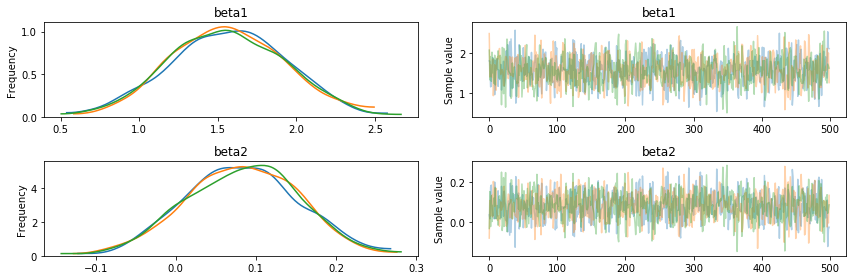
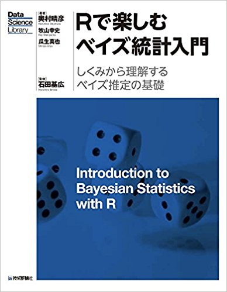
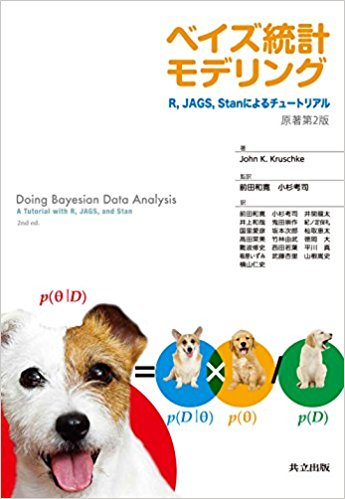

```{r eval=TRUE, echo=FALSE, warning=FALSE, message=FALSE, comment=""}
knitr::opts_chunk$set(echo = TRUE,
                      eval = TRUE,
                      warning = FALSE,
                      message = FALSE,
                      comment = "",
                      fig.height = 10,
                      fig.width = 10,
                      out.height = 300,
                      out.width = 300)
options(dplyr.print_max = 1e9)
```
# はじめに

## 誰？

<div class="column1">
- 松村優哉
- <u>Twitter</u>: **y\_\_mattu**
- <u>GitHub</u>: **ymattu**
- M2
- 計量経済学、ベイズ統計、因果推論、マーケティング
- 言語: R, Python, SAS
- https://ymattu.github.io/
- http://y-mattu.hatenablog.com/
- Tokyo.R / Japan.R 運営
</div>

<div class="column2">

</div>

## 著書(共著)
<div class="column1">

</div>
<div class="column2">
- 2 部構成
- 第一部(基礎編)
    - R 入門
    - R のデータハンドリング基礎
- 第二部(応用編)
    - テキストマイニング
    - R のパフォーマンス向上
    - 地理データ解析
    - ベイズ最適化入門
    - ...etc
</div>

## 著書 2  {#bo}

#### **R ユーザのための RStudio[実践]入門 <br> − tidyverse によるモダンな分析フローの世界−**
<div class="column1">

</div>

<div class="column2">
- 通称: 「**宇宙本**」
1. RStudio 入門(@y\_\_mattu)
2. スクレイピングによるデータ取得(@y\_\_mattu)
3. dplyr を中心としたデータハンドリング(@yutannihilation)
4. ggplot2 による可視化(@kyn02666)
5. R Markdown によるレポーティング(@kazutan)
</div>

# 本題
## この発表の目的
- ベイズ実践編の方々(LT, 応用セッション)に繋げる
- 繋げる: 全部は理解できなくても、何をしているのかくらいはだいたい分かるようにする
- ベイズ推定で頻繁に用いられる MCMC の基礎を理解
- 最近人気の Stan の基礎を理解

## おことわり
- 数学的な解説は最小限に留めます(教科書に書いてあるから)。
- 「何をやっているのか」を直感的に理解することを優先

## このスライドを見るには
https://github.com/ymattu/TokyoR70

- このスライドは**revealjs** パッケージで作成しています

# MCMC 導入 {#mcmcintro}
## なぜ MCMC か {#whymcmc}

$$
\begin{aligned}
p(\alpha \mid x) &= \frac{p(x \mid \alpha) \times p(\alpha)}{p(x)}
\end{aligned}
$$

- 知りたいのは事後分布$p(\alpha \mid x)$
- 例: $y = \beta x + e$ で $\beta$の事後分布を求めたい
- でも $p(x) = \int p(x \mid \alpha) \times p(\alpha) d\alpha$ は一般に計算が大変 <br> → MCMC をつかう

## MCMC(Markov Chain Monte Carlo) {#whatismcmc}
- すごくざっくり:「**サンプルをたくさん発生させて事後分布のかわりにしよう**」
- ざっくり: データ$x$が与えられたとき、事後分布$p(\alpha \mid x)$からパラメータ$\alpha$をサンプリングする手法

細かいことは抜きにして:

- Markov Chain: 前の状態で次が決まる
- Monte Carlo: 確率的なアルゴリズム

## 細かいことは抜きにして。。。
1. 初期点を決める
2. パラメータをしらみつぶしに変化させて尤度を計算していく
3. パラメータをプラス方向かマイナス方向に変えてみて、尤度が大きくなるようならその方向に続けて変えていく
4. 逆に尤度が小さくなるようなら、反対方向にパラメータを変えていく
5. これを収束するまで繰り返す
6. MCMC サンプルが完成→これをパラメータの分布にしよう!

## よく見る「あれ」が出来上がります
- これを traceplot といいます
- なんか 1 回じゃ心もとないから複数回(chain)やったほうがいいよね


## ここで疑問
1. なんでこうなるの？
2. 収束ってどういうこと？

# 疑問 1 <br> なんでこうなるのか {#question1}
## 仮定
- マルコフ連鎖では任意の確率変数からスタートした時に、最終的な確率変数の分布が不変になることを仮定
- この分布を**不変分布**という

## お天気の例
https://www.slideshare.net/teramonagi/ss-5190440

## MCMC のアイディア {#ideaofmcmc}
- サンプルを得たい確率密度関数が $p(x)$
- これを不変分布に持つようなマルコフ連鎖を生成(推移確率を与える)することで、実際のサンプリングをしよう
- サンプルが不変分布に近づく十分条件に**詳細釣り合い条件**というものがある

## 詳細釣り合い条件
ある状態 $x^t$ から $x^{t+1}$ に移るとき、次の式が成り立つ

$$
p(x_t) q(x_{t+1} \mid x_t) = p(x_{t+1}) q(x_t \mid x_{t+1})
$$

この $q(x \mid y)$ は提案分布と呼ばれ、現在の状態 $x^t$ から次の状態 $x^{t+1}$ を得るために用いる確率分布

## MCMC アルゴリズムの種類 {#kindmcmc}
- メトロポリス・ヘイスティングス法(M-H 法)
- ギブスサンプリング

# M-H法 {#mhmethod}
## アイディア {#ideaofmh}
- 必ずしも詳細つり合い条件を満たさない提案分布$q(x \mid y)$に対して、詳細釣り合い条件を成り立たせるための重み関数$a(x \mid y)
$が満たす条件を考える

$$
p(x^t t) q(x^{t+1} \mid x^t) w(x^{t+1} \mid x^t) = p(x^t t) q(x^{t+1} \mid x^t)
$$

- 提案分布$q(x \mid y)$によりサンプルされた$x$を$a(x \mid y)$の確率で採択することで、詳細つり合い条件を満たすようにサンプリングをしよう

## このときの採択確率
$$
a(x^{t+1} \mid x^t) = \min \left[1, \frac{p(x^t)q(x^{t+1}  \mid x^t)}{p(x^{t+1})q(x^t \mid x^{t+1})}\right]
$$

## うん、イメージがわかない
- 先人の手を借りましょう
- [可視化で理解するマルコフ連鎖モンテカルロ法](http://d.hatena.ne.jp/hoxo_m/20140911/p1)

# ギブスサンプリング
## アイデア {#ideaofgibbs}
- あるパラメータ以外を固定した条件付き分布からサンプリング
- 採択確率は常に1
- 提案分布と不変分布の関係を仮定できる

$$
q(x \mid x^t) = \begin{cases} p(x_i \mid x_{-i}^t) \; &x_{-i} = x_{-i}^t \\ 
0 \; &otherwise \end{cases}
$$

- これも可視化を見たほうが分かりやすい

# 収束について {#aboutconverge}
## バーンイン {#aboutburnin}
- 最初の方は初期値依存があるので事後分布の形成から省くことが多い


## MCMCでの収束 {#convergemcmc}

- Geweke の方法
- Geweke統計量Z値を計算し、MCMCのburn-in期間（前半10%）と後半50%を比較し、|Z|値が十分に小さければMCMCが収束したと考える


# Stan 入門 {#beginstan}
## Stan とは {#whatsstan}
- Hamiltonian Monte Carlo 法(HMC)とそれを応用した No-U-Turn Sampler(NUTS)用いたサンプラー
    - 注: マルコフ連鎖を使っていないので厳密には MCMC ではない
- 要は「モデル式を書けば勝手に MC(Monte Carlo)してサンプリングしてくれるもの」
    - モデル式: 尤度関数と事前分布
    - C++で動くので速い
- [公式マニュアル](https://github.com/stan-dev/stan/releases/download/v2.17.0/stan-reference-2.17.0.pdf)が丁寧(PDF 注意)
    - [和訳](https://stan-ja.github.io/gh-pages-html/)もあるよ

# R で Stan を使ってみる {#rstan}
## おことわり {#okotowari2}
- ここでは「使ってみる程度」の説明しかできません。
- いろいろな書き方は以下の資料が詳しいです。
    - https://www.slideshare.net/simizu706/stan-62042940
    - https://www.slideshare.net/simizu706/stan-64926504

## Stan のインストール {#installstan}
- OS ごとに違うので以下を見てください
- https://github.com/stan-dev/rstan/wiki/RStan-Getting-Started-(Japanese)

## rstan パッケージのインストール
- CRAN から

```{r eval=FALSE}
install.packages("rstan")
```

## R で Stan を使う流れ {#stanworkflow}
1. Stan コードを書く(sample.stan)
2. C++でコンパイル
```{r eval=FALSE}
stanmodel <- rstan::stan_model("sample.stan")
```
3. サンプリング
```{r eval=FALSE}
datlist <- list(...)
fit <- rstan::sampling(stanmodel, datlist, iter=10000, ...)
```
4. 結果を出力

# Stan の書き方 {#howtowritestan}

## とりあえず重回帰 {#regression}
- $y = b_0 + b_1 x_1 + b_2 x_2 + e, \; e \sim N(\mu, \sigma)$
- サンプルデータ
    - b0=2, b1=5, b2=-3 のデータを 400 個生成

```{r }
n <- 400
b0 <- 2
b1 <- 5
b2 <- -3
sigma <- 2

set.seed(71)
xx1 <- rnorm(n, 0, 1)
xx2 <- rnorm(n, 2, 2)
bx <- b0 + b1*xx1 + b2*xx2
yy <- rnorm(n, bx, sigma)

df <- data.frame(y = yy, x1 = xx1, x2 = xx2)
```

## サンプルデータ {#sampledatastan}
```{r, echo=FALSE}
knitr::kable(head(df, 10))
```

## Stan の文法
- function{}
- **data{}**
- transformed data{}
- **parameters{}**
- transformed parameters{}
- **model{}**
- generated quantities{}

注: 順番はこの順でなければならない

## 重回帰を書いてみる {#regstan}
これを `sample.stan` として保存
```{stan output.var="ymattu"}
data {
  int N ; // num of obs
  real x1[N] ; // independent variable 1
  real x2[N] ; // independent variable 2
  real y[N] ; // dependent variable
}

parameters {
  real b0 ;
  real b1 ;
  real b2 ;
  real<lower=0> sigma ;
}

model {
  for (i in 1:N) {
    y[i] ~ normal(b0 + b1 * x1[i] + b2 * x2[i], sigma) ;
  }
}
```

## 実行はRで {#kickinr}
```{r, eval=FALSE}
library(rstan)

# コンパイル
stanmodel <- stan_model("sample.stan")

datlist <- list(y = df$y,
                x1 = df$x1,
                x2 = df$y,
                N = nrow(df))

fit <- sampling(stanmodel, datlist)
```

```{r, echo=FALSE}
library(rstan)
load("fit.RDS")
```

## 収束を確認1 {#checkconverge}
トレースプロットを見る

```{r}
traceplot(fit)
```

## 収束を確認2 {#checkconverge2}
- Rhat という指標を見る
    - このあたりのパラメータの取り出し方は[北條さん資料](https://www.slideshare.net/daikihojo/stan-70425025)が詳しい
- これが 1.05(1.1とも)以下ならOK

```{r}
summary(fit)$summary
```

## Stan の書き方いろいろ {#staniroiro}
### モデルを短く書きたい
```
for (i in 1:N) {
    y[i] ~ normal(b0 + b1 * x1[i] + b2 * x2[i], sigma) ;
  }
```
↓
```
data {
  int N ; // num of obs
  real x1[N] ; // independent variable 1
  real x2[N] ; // independent variable 2
  real y[N] ; // dependent variable
}

parameters {
  real b0 ;
  real b1 ;
  real b2 ;
  real<lower=0> sigma ;
}

transformed parameters {
  real mu[N] ;
  for (i in 1:N) {
    mu[N] = b0 + b1 * x1[i] + b2 * x2[i]
  }
}

model {
  for (i in 1:N) {
    y[i] ~ normal(mu[i], sigma) ;
  }
}
```

## 行列で書きたい {#ewriteinmatrix}
- データやパラメータを行列やベクトルで宣言する必要あり

```
data {
  int N ;
  int M ; \\ num of independent variables
  vector[N] y ; \\ dependent variable
  matrix[N, M] x ; \\ independent variable matrix
}

parameters {
  vector[M] b ; \\ parameter vector
  real<lower=0> sigma ;
}

model {
  y ~ normal(x*b, sigma) ;
}
```

## R側も行列を作ります {#kikckrmatrix}
```{r, eval=FALSE}
datlist2 <- list(N = nrow(df),
                 y = df$y,
                 x = cbind(1, df$x1, df$x2),
                 M = ncol(x))
```

## あれ、そういえば事前分布は？
- 何も指定しなければ無情報事前分布(一様分布)
- でも指定してあげたほうがいい(ベイズだしね！)
- model ブロックに以下を書く(さっきの行列の例)

```
y ~ normal(x*b, sigma) ;
beta ~ normal(0, 100) ; 
sigma ~ cauchy(0, 5) ;
```

##　サンプリングの他の書き方 {#othersampling}
- `y ~ normal(mu, sigma)` は他の書き方もできる
- `target += normal_lpdf(y | mu, sigma)`
- `***lpdf` は対数確率を足し上げる作業
    - 実はこっちがStan内部でやっていることで、 `~` のほうが簡略表記
    
# ここまでやったところで {#kokomadestan}
## Stan は楽でいいね！ {#stanfun}
- Stan を使えばモデルを書くだけでパラメータ推定ができる!
- 尤度さえわかればモデルが書ける

## 一方で {#stanontheotherhand}
- モデルが正しく書けないとどうしようもない
    - モデル: 分布、行列etc...
- 発展的なモデル(階層モデル、状態空間モデル)を勉強するときはサボらずに尤度、行列表記くらいまではちゃんと理解できるよう努めましょう。

# まとめ {#matome}
## なにをやったか {#conclusion}
- MCMC をざっくり理解
- Stan の書き方をざっくり理解

※正直なところ、30-40分では「ちゃんと」は理解できないと思ってます

## 初心者セッション 1-3 をもっと詳しく知りたい人は {#more1}
#### R で楽しむベイズ統計
<div class = "column1">

</div>

<div class = "column2">
- 通称: サイコロ本
- ベイズの定理から MCMC まで **数学的な面も分かりやすく**解説
- わかりやすさと詳細さのバランスがとれた本
</div>

## 初心者セッション 1-3 をもっと詳しく知りたい人は {#more2}
#### ベイズ統計モデリング: R,JAGS,Stan によるチュートリアル
<div class = "column1">

</div>

<div class = "column2">
- 通称: 犬 4 匹本
- ベイズの定理から MCMC, Stan まで**わかりやすく**解説
- 鈍器なみに分厚いです
</div>

## 初心者セッション 1-3 をもっと詳しく知りたい人は {#more3}
#### Stan と R でベイズ統計モデリング
<div class = "column1">

</div>

<div class = "column2">
- 通称: アヒル本
- Stan によるベイズモデリングをしっかり、分かりやすく解説
- Stan 使うなら必携
</div>

## 理論面を理解したい人
- 『データ解析のための統計モデリング入門』（通称: 緑本）
- 『計算統計 II－マルコフ連鎖モンテカルロ法とその周辺』（ガチなやつ）
- https://www.youtube.com/watch?v=-H28H1unn0M (MCMC全般)
- 

# Enjoy! {#enjoy}
